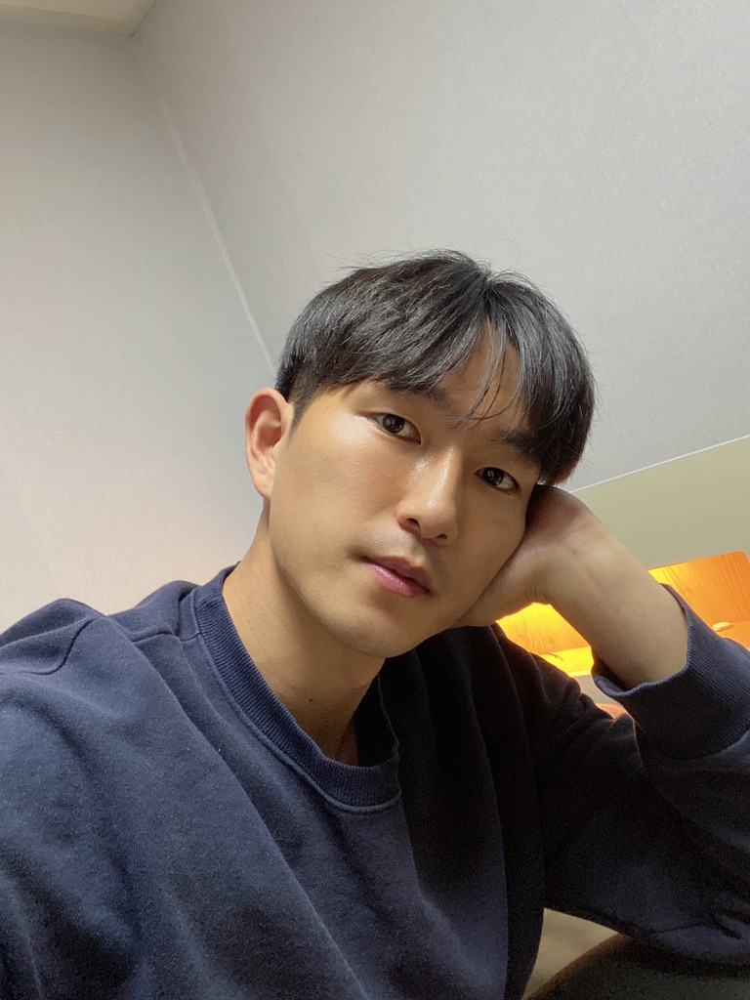

# 안녕하세요,
백앤드 개발자 황태훈입니다.

### 사람이 최우선인 서비스를 만들고싶습니다.
기술에서 비롯된 불편을 사용자가 감수하는 일이 없도록!

---

이런 개발을 했어요 💻

- Python(상), Node.js(중), Golang(하), Java(하)
- 쿠버테니스 기반 MSA 설계
- 쿠버네티스 클라이언트 라이브러리를 활용한 배포 툴 개발
- CI구축
- 컨테이너 기반 API서버 개발
- 머신러닝 파이프라인 검증 및 개선, 정확도 통계 알림 서비스 개발
- AWS를 활용한 캐시서버 유지보수 (ElasticBeanstalk, DynamoDB, DocumentDB, Lambda...)
- Kafka, ElasticStack, Nginx, FastAPI, MongoDB, Docker

[자세한 경력](https://www.notion.so/e8fbef102cd048cd90f2b05ed4cab45d)

---

제 고민들이 궁금하시다면?

[개발노트](https://www.notion.so/06df12637e5b4637b33aa5e8c35f3ba8)

---

[@hwangseonbi](https://github.com/hwangseonbi)

@hwangseonbi

@hwangseonbi